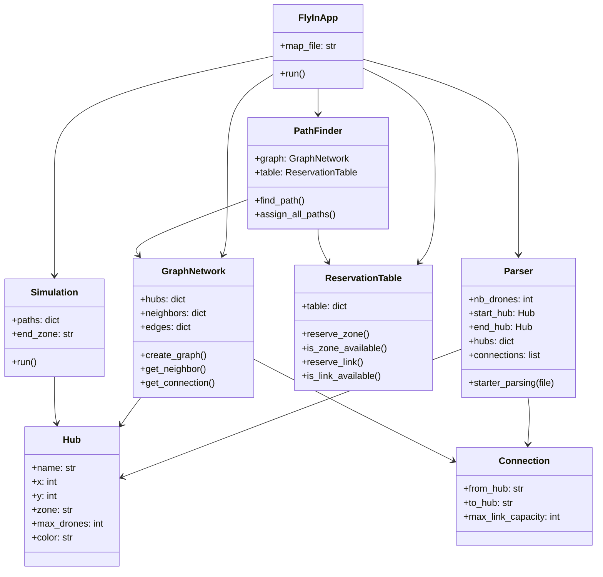
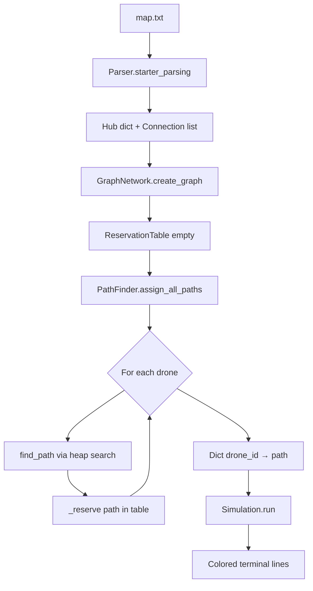
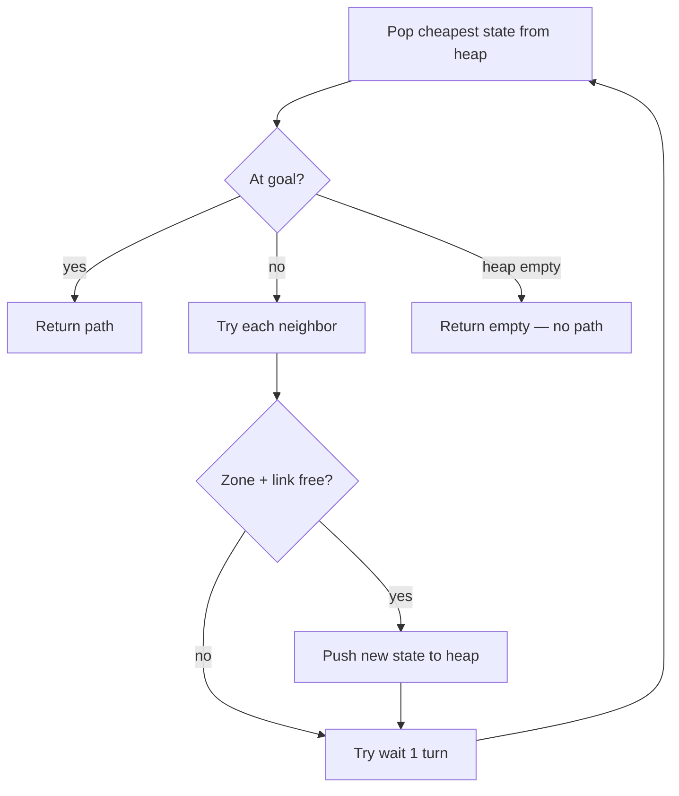

# Fly-in — Architecture

This document explains how the project is organized, how data flows through
the program, and what each class is responsible for.

> **Per-file docs:** see the [`docs/`](docs/README.md) folder for detailed
> architecture notes on every source file (`main.md`, `parser.md`, `algo.md`,
> etc.).

## High-level pipeline

The program runs in four stages:

```
map file  →  Parser  →  GraphNetwork
                              ↓
                    PathFinder + ReservationTable
                              ↓
                         Simulation  →  terminal output
```

1. **Parse** the map file into hubs, connections, and drone count.
2. **Build** an undirected graph from that data.
3. **Route** each drone with a space-time pathfinder that shares one
   reservation table.
4. **Simulate** by printing every move turn by turn with colors.

Entry point: `FlyInApp` in `main.py`.

---

## File map

| File | Role |
|------|------|
| `main.py` | Orchestrates the four stages (`FlyInApp`) |
| `parser.py` | Reads and validates the map file |
| `graph.py` | Stores hubs and connections as a graph |
| `zone.py` | Tracks zone/link usage per turn |
| `algo.py` | Finds paths for all drones (`PathFinder`) |
| `simulation.py` | Prints colored move lines each turn |
| `check_output.py` | Optional tool to detect zone collisions |

Per-file documentation: [`docs/`](docs/README.md)

Supporting config: `Makefile`, `setup.cfg`, `mypy.ini`.

---

## Class diagram



---

## Stage 1 — Parsing (`parser.py`)

### Classes

- **`Hub`**: one zone on the map (name, position, type, capacity, color).
- **`Connection`**: bidirectional link between two hubs with optional
  `max_link_capacity`.
- **`Parser`**: reads the file line by line and fills its public fields.

### Input format handled

```
nb_drones: 5
start_hub: start 0 0 [color=green]
hub: roof1 3 4 [zone=restricted color=red]
connection: start-roof1 [max_link_capacity=2]
```

### Validation rules

- First non-comment line must be `nb_drones:` with a positive integer.
- Exactly one `start_hub` and one `end_hub`.
- Zone names: no dashes, no spaces.
- Zone types: `normal`, `blocked`, `restricted`, `priority`.
- Capacities must be positive integers.
- Duplicate connections are rejected.
- Errors print the line number and stop the program.

### Output of this stage

```
Parser.nb_drones
Parser.start_hub / end_hub
Parser.hubs       → dict[name → Hub]
Parser.connections → list[Connection]
```

---

## Stage 2 — Graph (`graph.py`)

### Class: `GraphNetwork`

Builds an **undirected** adjacency list from parsed data.

| Field | Content |
|-------|---------|
| `hubs` | Same hub dict from the parser |
| `neighbors` | `zone → [neighbor names]` |
| `edges` | `(min, max) → Connection` for lookup |

### Important behavior

- **`get_neighbor(zone)`** skips `blocked` zones and blocked neighbors.
- **`get_connection(z1, z2)`** returns link metadata (capacity).

Coordinates (`x`, `y`) are stored but not used for routing — movement is
defined only by connections.

---

## Stage 3 — Routing (`algo.py` + `zone.py`)

This is the core of the project. Two classes work together:

### `ReservationTable` (`zone.py`)

A shared schedule of who uses what, and when.

```
Key                    Value
(zone_name, turn)   →  number of drones in that zone
(link_id, turn)     →  number of drones on that link
```

Link ids look like `gate1_gate2` (sorted hub names).

Methods:
- `reserve_zone` / `reserve_link` — add a drone to a slot
- `is_zone_available` / `is_link_available` — check capacity before moving

### `PathFinder` (`algo.py`)

Finds one path per drone, in order (D1, D2, …). Each path is reserved
before the next drone is routed.

#### Step A — Reachability (reverse BFS)

From the **goal**, walk backward through neighbors. Only hubs in this set
are considered during search. Dead-end zones are ignored.

#### Step B — Space-time search (min-heap)

Each heap item is a state:

```
(cost, id, zone, turn, path, visited_hubs)
```

- **cost** = number of turns spent so far
- **path** = list of `(zone_or_link, turn)` steps
- Search explores:
  - **Move** to a neighbor (1 turn normal/priority, 2 turns restricted)
  - **Wait** one turn in the same zone (only if goal-ward neighbors exist)

Priority neighbors are tried first (`priority` < `normal` < `restricted`).

#### Step C — Capacity checks before each move

| Check | When |
|-------|------|
| Zone free at arrival | Every move |
| Zone free at arrival − 1 **and** arrival | Restricted destination |
| Link free on every transit turn | Every move |
| Goal zone | Always allowed (no capacity block) |
| Start zone while waiting | Very high capacity (9999) |

#### Step D — Reservation after a path is found

`_reserve` walks the path and updates the table:

| Path entry | What gets reserved |
|------------|-------------------|
| `(zone, turn)` at start | Zone at that turn |
| `(a-b, turn)` link step | Link at turn; destination zone at turn and turn+1 |
| `(zone, turn)` normal arrival | Zone + link from previous hub |
| `(zone, turn)` after link step | Skipped (already reserved by link step) |

#### Path format examples

Normal move from `start` to `hello` in 1 turn:

```
[(start, 0), (hello, 1)]
```

Restricted move from `start` to `slow` in 2 turns:

```
[(start, 0), (start-slow, 1), (slow, 2)]
```

The middle step is printed as `D1-start-slow` during simulation.

---

## Stage 4 — Simulation (`simulation.py`)

### Class: `Simulation`

Takes the finished paths and prints one line per turn.

### Output rules (subject format)

- Each move: `D<id>-<zone>` or `D<id>-<from>-<to>` on a link step.
- Drones that **wait** (same zone as previous step) are **omitted**.
- Drones that reach **`end_zone`** are marked **delivered** and no longer
  tracked.
- Simulation stops when all drones are delivered.

### Colors

- Hub metadata `color=red` → ANSI color via `webcolors`.
- `color=rainbow` → cycling neon per character.
- Unknown colors are printed without styling.

---

## Data flow diagram



---

## Routing loop (one drone)



---

## Object ownership

```
FlyInApp
├── Parser          (local, discarded after parse)
├── GraphNetwork    (shared by PathFinder)
├── ReservationTable (shared by PathFinder, mutated per drone)
├── PathFinder      (uses graph + table)
└── Simulation      (read-only use of paths + hubs)
```

Nothing persists between runs. Each execution is stateless except for the
shared reservation table built during routing.

---

## Error handling

| Location | Behavior |
|----------|----------|
| `Parser` | Prints `Fatal Error: Line N: …` and exits |
| `main.py` | Catches parse exceptions, prints to stderr |
| `PathFinder` | Raises `ValueError` if a drone has no path |
| `Simulation` | Returns early if paths dict is empty |

---

## Testing helper (`check_output.py`)

`OutputChecker` runs `main.py` as a subprocess, strips ANSI codes, and
checks that two drones never appear in the same **zone** on the same turn
(link steps `a-b` are ignored).

Run with:

```bash
make check map=maps/hard/02_capacity_hell.txt
```

---

## Design choices

| Choice | Reason |
|--------|--------|
| OOP with one class per concern | Required by subject; easy to explain at eval |
| Custom graph, no networkx | Subject forbids graph libraries |
| Sequential routing (D1 then D2…) | Simple reservation; works well on all maps |
| Space-time heap, not pure BFS | Handles waiting and turn costs naturally |
| Reverse BFS from goal | Prunes dead-end expansion early |
| Reservation table | Prevents zone/link over-capacity across drones |

---

## Complexity (informal)

- **Parse**: O(lines in file)
- **Build graph**: O(hubs + connections)
- **Reverse BFS**: O(hubs + connections)
- **One drone search**: O(states × log states), states bounded by hubs × turns
- **All drones**: multiplied by `nb_drones`
- **Simulate**: O(total path steps)

---

## Quick reference for peer eval

**Q: What happens when you run the program?**
→ Parse map → build graph → route each drone → print simulation.

**Q: How do you avoid collisions?**
→ `ReservationTable` counts usage per zone/link per turn before accepting a move.

**Q: How do restricted zones work?**
→ 2-turn move, link step in output, destination reserved for 2 turns.

**Q: Why a heap?**
→ We want the **shortest** valid path in turns, respecting capacity.

**Q: Where is the graph?**
→ `GraphNetwork.neighbors` + `GraphNetwork.edges`, built from parsed connections.
