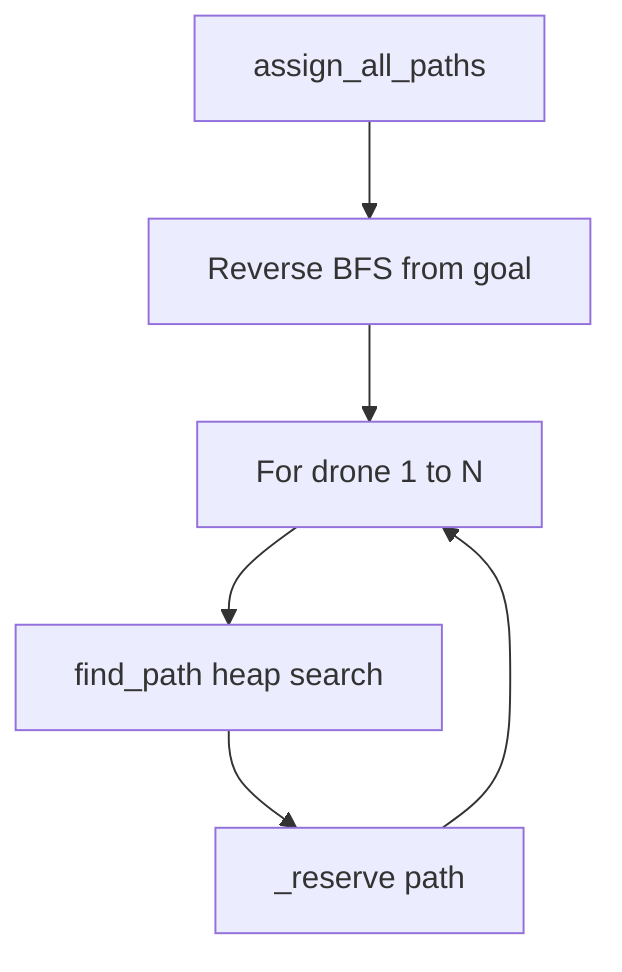

# algo.py

## Purpose

Finds a valid path for **each drone** from start to goal in minimum turns,
respecting zone types, capacities, and existing reservations.

This is the **core algorithm** of the project.

## Location in the pipeline

```
GraphNetwork + ReservationTable  →  PathFinder  →  dict[drone_id → path]
```

## Types

```python
PathStep = tuple[str, int]       # (zone_or_link, turn)
HeapItem = (cost, id, zone, turn, path, visited_hubs)
```

## Constants

```python
ZONE_PRIO = {"priority": 0, "normal": 1, "restricted": 2}
```

Lower number = tried first when expanding neighbors.

## Class: `PathFinder`

### Fields

| Field | Role |
|-------|------|
| `graph` | Network structure |
| `table` | Shared reservations |
| `heap_id` | Tie-breaker for heap stability |
| `can_reach` | Hubs that can still reach the goal |

### Public methods

| Method | Returns | Role |
|--------|---------|------|
| `find_path(start, end)` | `list[PathStep]` | One drone, shortest valid path |
| `assign_all_paths(start, end, nb)` | `dict[int, list]` | All drones D1…Dn |

### Private helpers

| Method | Role |
|--------|------|
| `_mark_reachable(end)` | Reverse BFS from goal |
| `_sorted_neighbors(zone)` | Goal-ward neighbors, priority sorted |
| `_zone_free(...)` | Zone capacity at arrival |
| `_link_free(...)` | Link capacity during transit |
| `_max_turn_limit()` | Cap waiting to avoid infinite search |
| `_reserve(path)` | Write path into reservation table |

---

## Algorithm overview



### Step 1 — Reverse BFS (`_mark_reachable`)

From the **goal**, walk backward through neighbors. Only hubs in
`can_reach` are expanded during search. Dead ends are pruned early.

### Step 2 — Space-time search (`find_path`)

Min-heap ordered by **turn cost**. Each state:

```
(zone, turn, path_so_far, visited_hubs)
```

From each state, try:

1. **Move** to a sorted neighbor
2. **Wait** one turn (if neighbors exist and under turn limit)

Stop when:
- Goal reached → return path
- Heap empty → return `[]` (no path)

### Step 3 — Move costs

| Destination zone type | Turns |
|----------------------|-------|
| normal | 1 |
| priority | 1 (preferred in neighbor order) |
| restricted | 2 |
| blocked | not reachable |

### Step 4 — Restricted move path format

Moving `start` → `slow` (restricted) at turn 0:

```python
[
  ("start", 0),
  ("start-slow", 1),   # on link — printed as D1-start-slow
  ("slow", 2),         # arrived
]
```

### Step 5 — Capacity checks

Before accepting a move:

| Check | When |
|-------|------|
| `_zone_free` at arrival | Always (except goal) |
| `_zone_free` at arrival−1 **and** arrival | Restricted destination |
| `_link_free` every transit turn | Always |
| Start zone while waiting | cap = 9999 |

### Step 6 — Reservation (`_reserve`)

| Path entry | Reservation |
|------------|-------------|
| First `(zone, turn)` | zone at turn |
| Link `(a-b, turn)` | link + zone b at turn and turn+1 |
| Normal `(zone, turn)` | zone + links from previous hub |
| After link step | **skip** duplicate zone reserve |

---

## Example: two drones, one bottleneck

```
Turn 1: D1 reserves gate@1
Turn 2: D2 search sees gate@1 full → waits or detours
```

Sequential routing (D1 then D2) + shared table = automatic deconfliction.

---

## Input / output

| In | Out |
|----|-----|
| start name, end name, nb_drones | `{1: path, 2: path, …}` |
| Graph + table state | Raises `ValueError` if any drone has no path |

---

## Dependencies

```python
from graph import GraphNetwork
from parser import Hub
from zone import ReservationTable
import heapq
```

---

## Complexity (informal)

- Reverse BFS: O(V + E)
- One search: O(states × log states), states ≤ hubs × max_turn
- All drones: × N

---

## Peer eval tips

- **Q: Dijkstra or BFS?** → Min-heap by turn count = shortest-path in
  time-expanded graph (space-time Dijkstra style).
- **Q: Why wait?** → When a zone/link is full, waiting may free a slot
  later.
- **Q: Why frozenset for visited?** → Hashable for heap; prevents cycle
  in same path.
- **Q: Why sequential drones?** → Simple; each reservation narrows options
  for the next drone.
