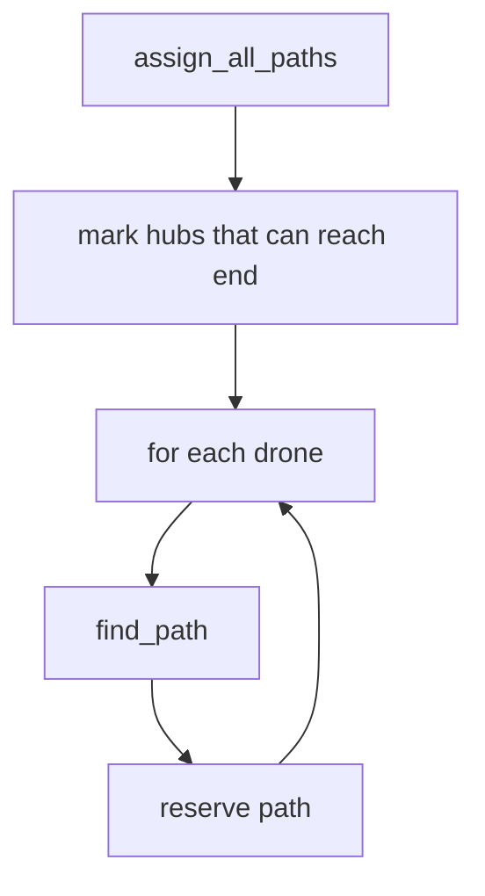

# `algo.py`

## Purpose

`algo.py` finds a valid route for every drone from the start hub to the end hub.
It uses a simple Dijkstra-style search over time:

```text
state = current zone + current turn
```

After a drone gets a path, that path is reserved before routing the next drone.
This lets later drones avoid full zones and full links.

---

## Main types

```python
PathStep = tuple[str, int]
```

A `PathStep` is:

```text
(zone_or_link_name, turn)
```

Examples:

```python
("gate", 1)        # drone is in zone gate at turn 1
("gate-maze", 2)   # drone uses link gate -> maze at turn 2
```

---

## Zone priority

Neighbors are tried in this order:

```python
priority -> normal -> restricted
```

This does not force a path. It only decides which equal-cost options are explored first.

---

## Search flow



---

## `find_path(start, end)`

Uses a min-heap:

```python
(cost, zone, turn, path)
```

At every state, the algorithm tries:

1. Move to each reachable neighbor
2. Wait one turn if the current zone has capacity

Already-checked `(zone, turn)` states are skipped, so loops cannot grow forever. The search stops when the current zone is the end zone.

A small congestion penalty is added for zones/links already used by earlier drones. This makes equal-cost routes split across multiple paths instead of always choosing the first neighbor.

---

## Normal movement

From a normal/priority zone `A` to zone `B`:

```python
("B", turn + 1)
```

Checks:

- link `A-B` at `turn + 1`
- zone `B` at `turn + 1`

---

## Restricted movement

Restricted cost is based on the **destination** zone, as required by the subject.

If the drone moves from `A` to restricted zone `B`, the path adds:

```python
("A-B", turn + 1)
("B", turn + 2)
```

Meaning:

| Turn       | Meaning                                               |
| ---------- | ----------------------------------------------------- |
| `turn + 1` | drone is on the connection toward restricted zone `B` |
| `turn + 2` | drone arrives in restricted zone `B`                  |

Output example:

```text
D1-A-B
D1-B
```

---

## Capacity checks

Before moving, the algorithm checks the reservation table.

### Normal/priority source

Moving `A -> B` checks:

- link `A-B` at `turn + 1`
- zone `B` at `turn + 1`

### Restricted destination

Moving from `A -> B` where `B` is restricted checks:

- link `A-B` at `turn + 1`
- link `A-B` at `turn + 2`
- zone `B` at `turn + 2`

The end zone ignores zone capacity.

---

## Reservation

After finding a path, `_reserve(path)` writes it into `ReservationTable`.

| Path step          | Reservation                           |
| ------------------ | ------------------------------------- |
| `("A", t)`         | reserve zone `A` at `t`               |
| `("A-B", t)`       | reserve link `A-B` at `t` and `t + 1` |
| repeated same zone | wait; reserve only the zone           |

If a zone step comes right after a link step, the link has already been reserved.

---

## Why drones are routed one by one

The algorithm is simple:

1. Find path for drone 1
2. Reserve it
3. Find path for drone 2 using the updated reservations
4. Repeat

This avoids collisions without needing one huge multi-drone search.

---

## Failure

If a drone cannot find any valid path, the algorithm raises:

```python
ValueError("No path for drone D...")
```
