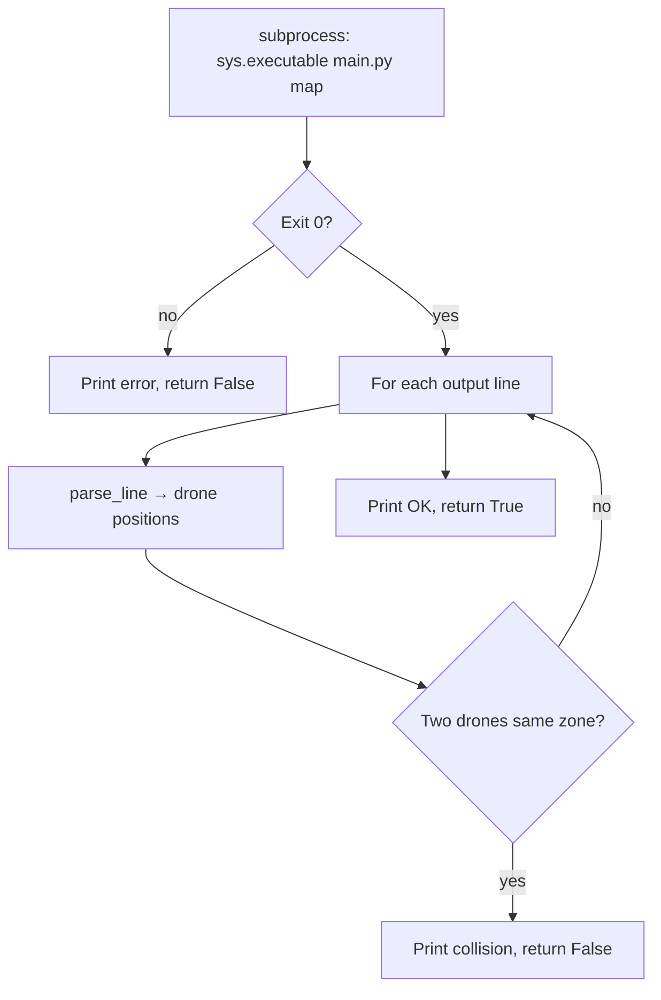

# check_output.py

## Purpose

Optional **test helper** (not required for submission). Runs the simulator
as a subprocess and checks that no two drones occupy the same **zone** on
the same turn.

## Location in the project

```
make check map=...  →  check_output.py  →  runs main.py  →  validates stdout
```

Not part of the main pipeline in `main.py`.

## Classes and functions

### `OutputChecker`

| Member | Role |
|--------|------|
| `map_path` | Map file to test |
| `ANSI_RE` | Regex to strip terminal color codes |

| Method | Role |
|--------|------|
| `parse_line(line)` | static — parse one output line |
| `run()` | Run simulator, check collisions, return bool |

### `main()`

CLI entry: `python3 check_output.py [map_file]`
Default map: challenger if no argument.

---

## How `run()` works



### `parse_line(line)`

1. Strip ANSI escape codes
2. Split tokens like `D1-gate_hell1`
3. Return `{drone_id: zone_name}`

Link moves (`gate1-gate2`) are kept in the dict but **ignored** for
collision checks (drone is in transit, not in a zone).

### Collision rule

Two drones in the same **zone name** on the same line → collision.

Does not validate:
- Link capacity
- Zone capacity over time (only per-line zone overlap)
- Turn optimality

---

## Input / output

| In | Out |
|----|-----|
| Map path (argv or default) | Prints status to stdout |
| | Exit code 0 = OK, 1 = fail |

Uses `sys.executable` so it runs with the same Python as the checker
(works with venv).

---

## Dependencies

```python
import re, subprocess, sys
```

No imports from other project modules.

---

## How to run

```bash
make check map=maps/hard/02_capacity_hell.txt
.venv/bin/python check_output.py maps/easy/01_linear_path.txt
```

---

## Limitations

- Basic sanity check only
- Ignores drones on link steps (`a-b` format)
- Does not replace full subject validation during peer eval

---

## Peer eval tips

- **Q: Is this graded?** → No, it's a dev test tool.
- **Q: Why subprocess?** → Tests the real program end-to-end, same as eval.
