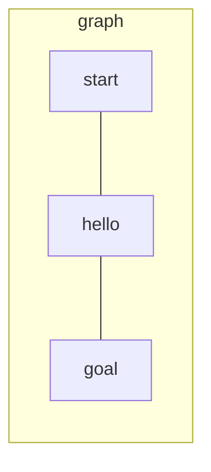

# graph.py

## Purpose

Builds an **undirected graph** from parsed hubs and connections. Provides
neighbor lookup and link metadata for pathfinding.

Coordinates (`x`, `y`) are stored on hubs but **not used** for routing —
movement is defined only by `connection:` lines.

## Location in the pipeline

```
Parser.hubs + Parser.connections  →  GraphNetwork  →  PathFinder
```

## Class: `GraphNetwork`

### Fields

| Field | Type | Content |
|-------|------|---------|
| `hubs` | `dict[str, Hub]` | Reference to all hubs |
| `neighbors` | `dict[str, list[str]]` | Adjacency list (hub names) |
| `edges` | `dict[tuple, Connection]` | Link lookup by sorted pair |

### Methods

#### `create_graph(hubs, connections)`

Builds the graph:

1. Copy hub dict
2. Init empty neighbor list per hub
3. For each connection, add both directions to `neighbors`
4. Store connection in `edges` with key `(min(a,b), max(a,b))`



#### `get_neighbor(zone) → list[Hub]`

Returns hubs reachable in **one move** from `zone`:

- If `zone` is **blocked** → empty list
- Skip neighbors whose hub type is **blocked**
- Return full `Hub` objects (not just names)

Used by pathfinding to expand moves.

#### `get_connection(z1, z2) → Connection | None`

Returns the `Connection` between two hubs (order doesn't matter).
Used to read `max_link_capacity` during link capacity checks.

## How blocked zones work

```
hub: obstacle 5 5 [zone=blocked]

get_neighbor("obstacle")  →  []
get_neighbor("start")     →  does not include "obstacle"
```

A blocked hub cannot be entered and acts as a wall.

## Input / output

| In | Out |
|----|-----|
| `dict` of hubs, `list` of connections | Populated `GraphNetwork` |

## Dependencies

```python
from parser import Connection, Hub
```

## Used by

- `main.py` — creates graph after parsing
- `algo.py` — `get_neighbor`, `get_connection`, `hubs`

## Design note

No external graph library (networkx forbidden by subject). The graph is a
simple adjacency list + edge dict — enough for BFS and neighbor expansion.
