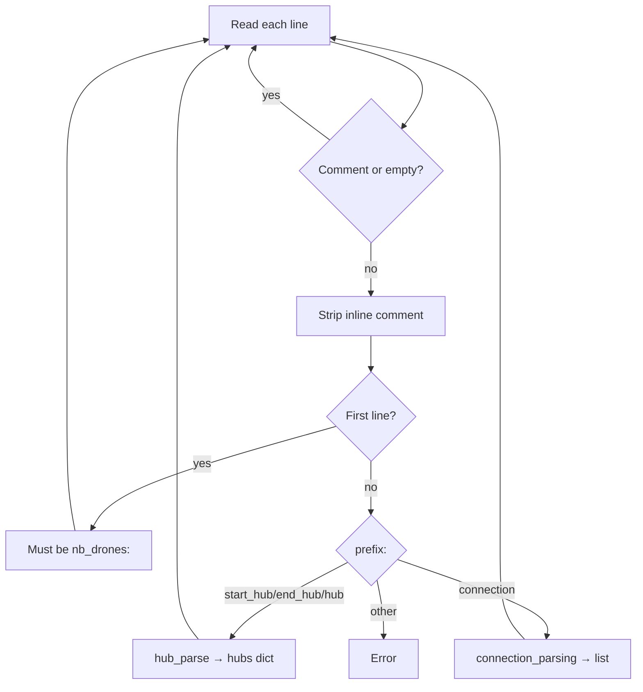

# parser.py

## Purpose

Reads and validates the map file format. Turns text lines into `Hub` and
`Connection` objects that the rest of the program uses.

## Location in the pipeline

```
map.txt  →  Parser  →  hubs dict + connections list + nb_drones
```

## Classes

### `Hub`

Represents one zone on the map.

| Field | Default | Meaning |
|-------|---------|---------|
| `name` | required | Unique zone name (no `-` or spaces) |
| `x`, `y` | required | Integer coordinates (stored, not used for routing) |
| `zone` | `"normal"` | Type: normal, blocked, restricted, priority |
| `max_drones` | `1` | Max drones in zone at same turn |
| `color` | `"none"` | Terminal color name for simulation |

### `Connection`

Bidirectional link between two hubs.

| Field | Default | Meaning |
|-------|---------|---------|
| `from_hub`, `to_hub` | required | Hub names (must exist) |
| `max_link_capacity` | `1` | Max drones on link at same turn |

### `Parser`

Main parser class. Public fields after parsing:

| Field | Type | Content |
|-------|------|---------|
| `nb_drones` | `int` | Fleet size |
| `start_hub` | `Hub` | Starting zone |
| `end_hub` | `Hub` | Goal zone |
| `hubs` | `dict[str, Hub]` | All zones by name |
| `connections` | `list[Connection]` | All links |

## Methods

| Method | Visibility | Role |
|--------|------------|------|
| `open_file(file)` | public | Read file lines; raise on missing file |
| `parse_nb_drone(line, i)` | public | Parse `nb_drones: N` |
| `hub_parse(data, i)` | public | Parse one hub line |
| `connection_parsing(data, i)` | public | Parse one connection line |
| `starter_parsing(file)` | public | Main loop over all lines |
| `_parse_metadata(attr, i)` | private | Parse `[zone=... color=...]` |
| `_extract_brackets(data, i)` | private | Split data into body + metadata; validate bracket syntax |
| `_strip_inline_comment(line)` | static | Remove `# ...` after data (respects brackets) |

## How `starter_parsing` works



Rules enforced:
- First real line must be `nb_drones:` (positive integer)
- Exactly one `start_hub` and one `end_hub`
- No duplicate hub names or connections
- Connections only between existing hubs
- Self-connections (`a-a`) are rejected
- Zone names must not contain dashes or spaces
- Bracket syntax is validated: unclosed `[`, stray `]`, or text after `]` → error
- Inline comments (`# ...` after data) are stripped before parsing
- Invalid metadata → `ValueError` with line number and cause

## Example input

```
nb_drones: 2
start_hub: start 0 0 [color=green]
hub: hello 1 0 [color=blue]
end_hub: goal 3 0 [color=red]
connection: start-hello
connection: hello-goal
```

## Example output (parser state)

```python
parser.nb_drones == 2
parser.start_hub.name == "start"
parser.end_hub.name == "goal"
len(parser.hubs) == 3
len(parser.connections) == 2
```

## Error handling

Parser prints `Fatal Error: ...` to stderr and calls `sys.exit(1)` on:
- Missing or invalid `nb_drones` (empty, non-integer, zero, negative)
- Missing `start_hub` or `end_hub` after parsing
- Duplicate hub names, duplicate `start_hub`/`end_hub`, or duplicate connections
- Undefined hubs referenced in connections
- Self-connections (`a-a`)
- Malformed bracket syntax (unclosed `[`, stray `]`, trailing text after `]`)
- Unknown metadata keys or invalid values (`zone=invalid`, `max_drones=0`)
- Unknown line prefix (not `hub`, `start_hub`, `end_hub`, `connection`)
- Missing `:` separator on content lines

### Error examples

| Input | Error |
|-------|-------|
| `start_hub: s 0 0 [zone=normal` | `Unclosed '[' in metadata` |
| `start_hub: s 0 0 zone=normal]` | `Unexpected ']' without opening '['` |
| `start_hub: s 0 0 [zone=normal] extra` | `Unexpected text after ']'` |
| `connection: s-s` | `Self-connection 's-s'` |
| `hub: my-hub 0 0` | `Zone name 'my-hub' contains invalid characters` |
| `hub: h 0 0 [zone=invalid]` | `Invalid zone type 'invalid'` |
| `start_hub: s 0 0 # comment` | OK — inline comment stripped |

## Dependencies

- Standard library only: `sys`, `typing`
- No imports from other project files

## Used by

- `main.py` — creates `Parser`, calls `starter_parsing`
- `graph.py` — receives `Hub` and `Connection` objects
- `simulation.py` — uses `Hub` for colors
