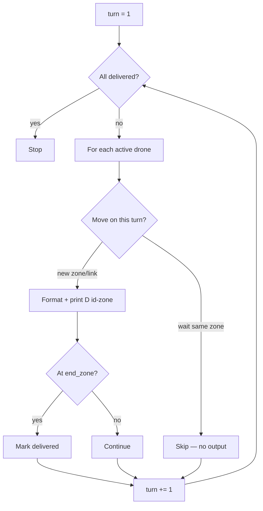

# simulation.py

## Purpose

Takes the finished paths from `PathFinder` and **prints** each drone move
turn by turn with **ANSI colors** in the subject output format.

## Location in the pipeline

```
PathFinder paths dict  →  Simulation.run()  →  stdout (colored lines)
```

## Class: `Simulation`

### Constructor inputs

| Parameter | Type | Role |
|-----------|------|------|
| `paths` | `dict[int, list[PathStep]]` | Each drone's scheduled moves |
| `end_zone` | `str` | Goal hub name (delivery detection) |
| `hubs` | `dict[str, Hub]` | Color metadata lookup |

### Fields

| Field | Role |
|-------|------|
| `reset` | ANSI reset code `\033[0m` |
| `rainbow` | List of neon color codes for rainbow mode |

---

## How `run()` works



### Turn loop

1. Loop `turn` from 1 to last turn in any path
2. For each drone **not yet delivered**:
   - Find path step where `step_turn == turn`
   - If zone equals previous zone → **waiting** → omit from output
   - Else print `D{id}-{zone}` with color
   - If zone == `end_zone` → mark drone **delivered**
3. Stop early when all drones delivered

### Output format (subject)

```
D1-hello D2-start
D1-goal D2-hello
D2-goal
```

Restricted link step example:

```
D2-start-slow_path1
```

---

## Color system

### `_hub_color(zone)`

| Move type | Color source |
|-----------|--------------|
| Normal zone `hello` | `hubs["hello"].color` |
| Link `start-slow` | `hubs["slow"].color` (destination) |

### `_color_code(name)`

Uses `webcolors.name_to_rgb()` → true-color ANSI `\033[38;2;R;G;Bm`.

Invalid or `none` → no color.

### `_rainbow_text(text, drone_id)`

If hub color is `rainbow`, each character gets a cycling neon code.

### `_format_move(text, color, drone_id)`

Chooses rainbow, solid color, or plain text.

---

## Rules implemented

| Subject rule | Implementation |
|--------------|----------------|
| One line per turn | `print(" ".join(moves))` |
| Format `D<ID>-<zone>` | `f"D{drone_id}-{zone}"` |
| Waiting omitted | `zone == last_zone[drone_id]` → skip |
| Delivered drones not tracked | `delivered` set, skip in loop |
| Simulation ends when all delivered | `len(delivered) == len(paths)` |

---

## Input / output

| In | Out |
|----|-----|
| Paths + end zone + hubs | Colored text lines on stdout |

Does **not** use `ReservationTable` — paths are already valid.

---

## Dependencies

```python
import webcolors
from parser import Hub
```

---

## Used by

- `main.py` only

---

## Peer eval tips

- **Q: Why skip same zone?** → Waiting is valid but not printed per subject.
- **Q: Why store paths not live simulation?** → Paths computed upfront;
  simulation is replay + display.
- **Q: Coordinates unused?** → Correct; layout is in the map file but
  routing uses connections only.
