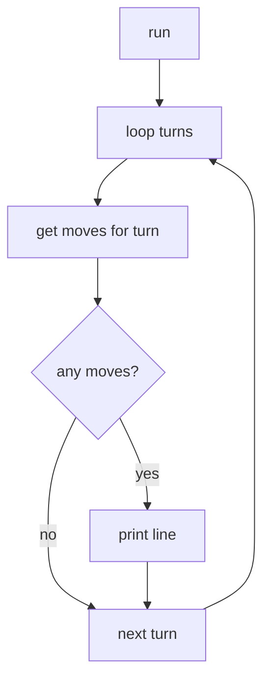

# `simulation.py`

## Purpose

`simulation.py` prints the final drone paths turn by turn.

It does not calculate paths and it does not check collisions. `algo.py` already did that.
This file only replays the paths and formats the output.

---

## Input

```python
Simulation(paths, end_zone, hubs)
```

| Value      | Meaning                         |
| ---------- | ------------------------------- |
| `paths`    | routes returned by `PathFinder` |
| `end_zone` | goal zone name                  |
| `hubs`     | hub metadata, mainly colors     |

A path step is:

```python
(zone_or_link, turn)
```

Example:

```python
("gate", 1)
("gate-maze", 2)
```

---

## Output

One line is printed per turn, only when at least one drone moves:

```text
D1-gate D2-start
D1-gate-maze D2-gate
D1-maze
```

Waiting is not printed.

---

## Main flow



---

## Important rules

| Rule                     | Code behavior                                                       |
| ------------------------ | ------------------------------------------------------------------- |
| Same zone twice          | treated as waiting, not printed                                     |
| `D{id}-{move}`           | standard output format                                              |
| Drone reaches `end_zone` | marked delivered and skipped later                                  |
| Link move like `A-B`     | drone is in transit toward restricted zone `B`; printed as `D1-A-B` |

---

## Colors

A move can be colored from hub metadata.

| Move  | Color comes from    |
| ----- | ------------------- |
| `A`   | hub `A`             |
| `A-B` | destination hub `B` |

Supported color values:

- normal CSS color names, using `webcolors`
- `rainbow`
- `none` / invalid colors → plain text

---

## Used by

- `main.py`
