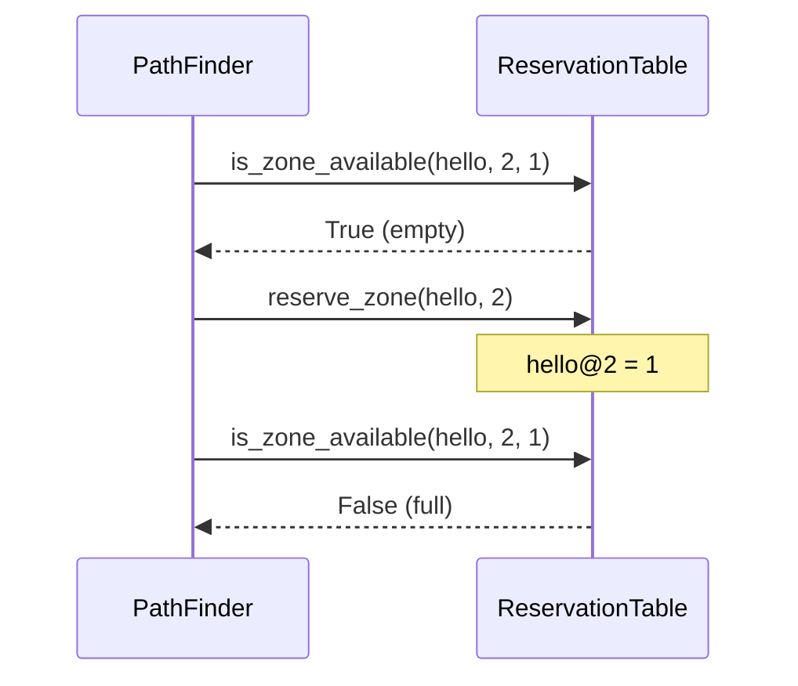

# zone.py

## Purpose

Tracks **how many drones** occupy each zone and link at each **turn**.
Shared by all drones during routing so paths don't conflict.

## Location in the pipeline

```
PathFinder.find_path  →  reads table (is_*_available)
PathFinder._reserve   →  writes table (reserve_*)
```

## Class: `ReservationTable`

### Internal storage

```python
table: dict[tuple[str, int], int]
```

| Key example | Value | Meaning |
|-------------|-------|---------|
| `("hello", 3)` | `2` | 2 drones in zone `hello` at turn 3 |
| `("gate1_gate2", 5)` | `1` | 1 drone on link gate1↔gate2 at turn 5 |

Link keys use sorted names: `f"{min(z1,z2)}_{max(z1,z2)}"`.

### Methods

#### `reserve_zone(zone_name, turn)`

Increment count for `(zone_name, turn)` by 1.

#### `is_zone_available(zone_name, turn, max_drones) → bool`

```python
count < max_drones  →  True (room available)
```

#### `reserve_link(z1, z2, turn)`

Increment count for the link at that turn.

#### `is_link_available(z1, z2, turn, max_link_capacity) → bool`

Same logic as zones, for link capacity.

## How it prevents collisions



Drone D1 reserves first; D2's search sees the zone as full at that turn and
must wait or take another path.

## Lifecycle

1. `main.py` creates empty `ReservationTable`
2. `PathFinder` gets one path per drone (D1, D2, …)
3. After each path, `_reserve` fills the table
4. Next drone's `find_path` reads the updated table

The table is **write-only during routing**, **read-only during simulation**
(simulation does not use it).

## Dependencies

- Standard library only: `typing`

## Used by

- `main.py` — creates table, passes to `PathFinder`
- `algo.py` — all capacity checks and reservations

## Peer eval tips

- **Q: Why not check collisions only at the end?** → Table checks *before*
  accepting a move, so invalid paths are never chosen.
- **Q: What happens at the goal?** → PathFinder skips capacity check for
  the end zone (`_zone_free` returns True for goal).
