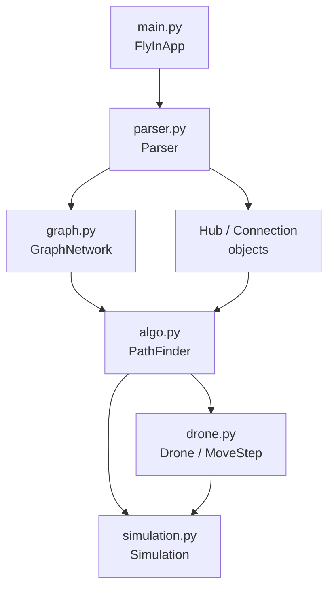

# Fly-in: Complete Technical Documentation

---

## Table of Contents

1. [Architecture Overview](#1-architecture-overview)
2. [Data Flow Pipeline](#2-data-flow-pipeline)
3. [File-by-File Breakdown](#3-file-by-file-breakdown)
4. [Algorithm Deep Dive](#4-algorithm-deep-dive)
5. [Why This Algorithm (and Why Not Others)](#5-why-this-algorithm)
6. [Complexity & Speed Analysis](#6-complexity--speed-analysis)
7. [Reservation System Design](#7-reservation-system-design)
8. [How To Add `--capacity-info` Flag](#8-how-to-add-capacity-info-flag)
9. [Performance Results](#9-performance-results)

---

## 1. Architecture Overview



### Why this structure?

Each file has **one job**:

| File | Responsibility | Why separated |
|------|---------------|---------------|
| `main.py` | CLI entry point | Keeps I/O concerns away from logic |
| `parser.py` | Read map file → data objects | Parsing rules change independently from routing |
| `graph.py` | Adjacency structure | Graph topology is a separate concern from parsing |
| `drone.py` | Drone identity + MoveStep | Path representation is independent from search |
| `algo.py` | Pathfinding + reservation | The core brain — isolated for testability |
| `simulation.py` | Turn-by-turn output | Output formatting is independent from routing |

### Why NOT one big file?

- During peer eval, the reviewer asks you to modify something. With 6 small files (~50-230 lines each), you find the right spot in seconds.
- Each class can be tested independently.
- The subject says "completely object-oriented" — this structure proves it.

---

## 2. Data Flow Pipeline

```
map.txt ──→ Parser ──→ MapData ──→ GraphNetwork ──→ PathFinder ──→ Simulation ──→ stdout
              │                        │                │               │
              ▼                        ▼                ▼               ▼
         Hub, Connection         adjacency list    Drone + MoveStep   colored text
         (with reservations)     + edge lookup      (paths assigned)
```

**Step by step:**

1. **Parse**: `Parser.starter_parsing("map.txt")` reads lines, validates syntax, returns `MapData` (which bundles `nb_drones`, `start_hub`, `end_hub`, `hubs dict`, `connections list`).

2. **Build Graph**: `GraphNetwork(hubs, connections)` creates:
   - `self.neighbors`: `{"A": ["B", "C"], "B": ["A"], ...}` — adjacency list
   - `self.edges`: `{("A","B"): Connection, ...}` — edge lookup by sorted key

3. **Route Drones**: `PathFinder(graph).assign_all_paths(start, end, nb_drones)` finds one path per drone, reserves it immediately, then finds the next.

4. **Print Output**: `Simulation(drones, end, hubs).run()` replays each turn and prints `D1-zone D2-zone`.

---

## 3. File-by-File Breakdown

### `parser.py` — Hub, Connection, MapData, Parser

#### Hub (lines 7-42)

```python
class Hub:
    name: str          # e.g. "roof1"
    x, y: int          # coordinates
    zone: str          # "normal" | "restricted" | "priority" | "blocked"
    max_drones: int    # default 1
    color: str         # for terminal output
    reservations: dict[int, int]  # {turn: count}
```

**Why Hub tracks its own reservations:**
- Before: we had a separate `ReservationTable` class with `reserve_zone(name, turn)`. This meant Hub didn't know its own state — you'd have to pass the table everywhere.
- After: `hub.reserve(turn)` and `hub.is_available(turn)` are right on the object. The PathFinder just asks the hub directly: "do you have room at turn 5?"

**The 4 reservation methods:**

| Method | What it does | Who calls it |
|--------|-------------|-------------|
| `reserve(turn)` | Increments `reservations[turn]` by 1 | `PathFinder._reserve()` |
| `usage(turn)` | Returns count at turn (or 0) | Capacity info display |
| `is_reserved(turn)` | True if count > 0 | Capacity info display |
| `is_available(turn)` | True if `usage(turn) < max_drones` | `PathFinder._zone_free()` |

#### Connection (lines 45-74)

Identical pattern to Hub but for links:
- `max_link_capacity` instead of `max_drones`
- Same 4 methods: `reserve`, `usage`, `is_reserved`, `is_available`

**Why the same pattern?** Because zones and links have the same problem: "how many drones are using me at turn T?" The answer is always `reservations.get(turn, 0)`.

#### Parser (lines 88-435)

Reads the map file line by line. Key validations:
- First non-comment line must be `nb_drones: N` (positive integer)
- Exactly one `start_hub:` and one `end_hub:`
- Zone names: no dashes, no spaces (because connections use `name1-name2`)
- No duplicate connections (`a-b` = `b-a`)
- Zone types must be: normal, blocked, restricted, priority
- `max_drones` and `max_link_capacity` must be positive integers
- Every error message includes the line number

**Why validate so strictly?** The subject says: "Any other parsing error must stop the program and return a clear error message indicating the line and cause." During eval, they will throw bad map files at you.

---

### `graph.py` — GraphNetwork

```python
class GraphNetwork:
    hubs: dict[str, Hub]                      # all hubs by name
    neighbors: dict[str, list[str]]           # adjacency list
    edges: dict[tuple[str, str], Connection]  # edge lookup
```

**Why `(min(src, dst), max(src, dst))` as the edge key?**

Because connections are bidirectional. `A-B` and `B-A` are the same edge. By always sorting the key alphabetically, we guarantee one canonical lookup regardless of direction:

```python
# Both of these return the same Connection:
get_connection("roof1", "goal")  # key = ("goal", "roof1")
get_connection("goal", "roof1")  # key = ("goal", "roof1")
```

**Why `get_neighbor` skips blocked zones?**

```python
def get_neighbor(self, zone):
    if self.hubs[zone].zone == "blocked":
        return []                    # blocked zones have NO neighbors
    return [h for h in ... if h.zone != "blocked"]  # skip blocked destinations
```

This means the PathFinder never even considers blocked zones. Zero chance of accidentally routing through one.

---

### `drone.py` — MoveStep, Drone

#### MoveStep

A MoveStep represents **one step** in a drone's planned path. It comes in two flavors:

**Zone step** — the drone is sitting at a zone:
```python
MoveStep.at_zone("roof1", turn=3, via=("hub", "roof1"))
#   zone = "roof1"
#   turn = 3
#   via  = ("hub", "roof1")  ← the connection used to get here
#   is_link = False
#   label = "roof1"
```

**Link step** — the drone is on a connection (restricted zone transit):
```python
MoveStep.on_link("hub", "roof1", turn=2)
#   src = "hub", dst = "roof1"
#   turn = 2
#   is_link = True
#   label = "hub-roof1"
```

**Why `via`?**

When reserving a path, we need to know which **connection** the drone used to arrive at a zone. Without `via`, the `_reserve` method had to look backwards at `path[i-1]` to figure it out — ugly and error-prone:

```python
# BEFORE (bad): look backwards
for i, step in enumerate(path):
    if i > 0:
        prev = path[i - 1]
        if not prev.is_link and prev.zone != step.zone:
            conn = graph.get_connection(prev.zone, step.zone)
```

```python
# AFTER (clean): each step knows its own connection
for step in path:
    if step.via:
        conn = graph.get_connection(*step.via)
```

**Why `__slots__`?**

```python
__slots__ = ("turn", "_zone", "_src", "_dst", "_via")
```

MoveSteps are created by the thousands during search. `__slots__` saves ~40% memory per object by skipping the `__dict__`. On the challenger map (25 drones, complex graph), this matters.

#### Drone

Simple data holder:
```python
class Drone:
    drone_id: int       # 1, 2, 3, ...
    origin: str         # start zone name
    destination: str    # end zone name
    path: list[MoveStep]  # assigned by PathFinder
    reserved: bool      # True after path is reserved
```

**Why `name` is a property?** Because `f"D{self.drone_id}"` is derived — storing it would be redundant.

---

### `algo.py` — PathFinder

This is the brain. 5 sections:

#### Section 1: Reachability

```python
def _mark_reachable(self, end):
```

Before searching, we do a **reverse DFS** from the goal. This marks every hub that has *any* path to the end. Why?

- Dead-end zones are never explored → faster search
- We avoid routing a drone into a cul-de-sac where it gets stuck
- One-time cost: O(V + E), then reused for all drones

#### Section 2: Capacity checks

```python
def _zone_free(self, zone, turn, start, end) → bool
def _link_free(self, src, dst, turn) → bool
def _can_move(self, src, dst, turn, start, end) → bool
```

**Why `start` and `end` are passed to `_zone_free`?**

The subject says: "The start zone: all drones begin here and may share the space initially. The end zone: multiple drones can arrive here." So start and end have unlimited capacity:

```python
if zone == start or zone == end:
    return True  # always room
```

**Why `_can_move` checks different turns for restricted?**

For a normal zone: drone arrives at `turn + 1`.
For a restricted zone: drone is on the link at `turn + 1`, arrives at zone at `turn + 2`.
So we must check the link is free at BOTH `turn + 1` and `turn + 2`, and the zone is free at `turn + 2`.

#### Section 3: Step building

```python
def _move_steps(self, src, dst, turn) → list[MoveStep]
```

Normal zone → 1 step: `[at_zone(dst, turn+1, via=(src,dst))]`
Restricted zone → 2 steps: `[on_link(src, dst, turn+1), at_zone(dst, turn+2)]`

**Why restricted returns 2 steps?** Because the output format requires showing the drone on the connection: `D1-hub-roof1` (turn 1), then `D1-roof1` (turn 2).

#### Section 4: Search (the core)

```python
def find_path(self, start, end) → list[MoveStep]
```

This is a **modified Dijkstra** using a min-heap. Each state is `(turn, cost, priority, zone, path)`.

**Why Dijkstra and not BFS?**

BFS treats all edges equally. But our edges have different costs:
- Normal zone: 1 turn
- Restricted zone: 2 turns  
- Priority zone: 1 turn but preferred

Dijkstra naturally handles weighted edges. The heap always pops the state with the lowest turn count first.

**Why not A*?**

A* requires a heuristic (estimated distance to goal). Our graph has coordinates, so we could use Euclidean distance. But:
- Coordinates are just for visualization, not actual distances
- The graph topology doesn't follow geometric distance (a zone at (0,0) might connect to (100,100) directly)
- A bad heuristic makes A* slower than Dijkstra
- Dijkstra is simpler and already fast enough (43 turns on challenger)

**Why not BFS with time expansion?**

We could pre-build a time-expanded graph (one copy of the graph per turn), then run BFS. But:
- Memory explodes: `V × T` nodes (e.g., 50 zones × 100 turns = 5000 nodes per drone)
- We don't know T in advance
- Dijkstra on the original graph with time as part of the state is equivalent and uses less memory

**The heap tuple: `(turn, cost, priority, zone, path)`**

Why this specific order?

1. `turn` — primary sort: prefer paths that arrive sooner
2. `cost` — tiebreaker: accumulated zone priority (priority=0 < normal=1 < restricted=2). Between two paths arriving at the same turn, prefer the one through priority zones
3. `priority` — secondary tiebreaker: the priority of the current zone
4. `zone` — just for identification (which zone we're at)
5. `path` — the full list of MoveSteps so far

**The waiting logic:**

```python
wait = turn + 1
if wait <= limit and self._zone_free(zone, wait, start, end):
    heapq.heappush(heap, (wait, cost + 1, prio, zone,
                          path + [MoveStep.at_zone(zone, wait)]))
```

A drone can stay in its current zone for one more turn. This is essential when all neighbors are blocked — the drone waits until a slot opens up.

**The turn limit:**

```python
limit = self._max_turn + len(self.graph.hubs) * 4
```

Without a limit, the search could wait forever. `_max_turn` is the latest turn any previous drone uses. We add `hubs × 4` as breathing room. Why ×4? Enough for a drone to wait through congestion but not so much that we waste time on impossible searches.

#### Section 5: Reservation

```python
def _reserve(self, path):
```

After finding a path, we "stamp" it into the Hub and Connection objects:

- **Link step**: reserve the connection at both `turn` and `turn + 1` (drone occupies the link for the full transit)
- **Zone step**: reserve the zone at `turn`, and if `step.via` exists, also reserve the connection at `turn` (the turn the drone arrives)

**Why reserve connection at arrival turn?**

When drone D1 arrives at zone B via connection A-B at turn 5, the connection A-B is "used" at turn 5. If D2 also wants to traverse A-B at turn 5, it would exceed capacity. So we reserve it.

#### assign_all_paths — the public API

```python
for drone_id in range(1, nb_drones + 1):
    path = find_path(start, end)  # search with current reservations
    _reserve(path)                 # block slots for this drone
```

**Why sequential, not parallel?**

Each drone's path depends on what's already reserved. Drone 2 might take a different route because Drone 1 already claimed the shortest one. This is a **greedy sequential** approach.

**Why not optimize all drones simultaneously?**

True multi-agent pathfinding (MAPF) is NP-hard. The optimal solution would try all possible path combinations. With 25 drones and 50+ zones, that's computationally infeasible. The greedy approach gives excellent results in practice (43 turns on the challenger map vs. 45 target).

---

## 4. Algorithm Deep Dive

### Full walkthrough with example

Map:
```
nb_drones: 2
start_hub: S 0 0
hub: A 1 0
hub: B 0 1
end_hub: E 1 1
connection: S-A
connection: S-B
connection: A-E
connection: B-E
```

**Drone 1 search:**

1. Heap: `[(0, 0, 1, "S", [at_zone("S", 0)])]`
2. Pop S at turn 0. Neighbors: A, B
   - Push A: `(1, 1, 1, "A", [at_zone("S",0), at_zone("A",1,via=("S","A"))])`
   - Push B: `(1, 1, 1, "B", [at_zone("S",0), at_zone("B",1,via=("S","B"))])`
3. Pop A at turn 1 (or B, same cost). Neighbors: E
   - Push E: `(2, 2, 1, "E", [..., at_zone("E",2,via=("A","E"))])`
4. Pop E at turn 2. zone == end → **return path**

Path: `S(t=0) → A(t=1) → E(t=2)`

**Reserve:** S at t=0, A at t=1, connection S-A at t=1, E at t=2, connection A-E at t=2.

**Drone 2 search:**

1. Same start. Pop S at turn 0.
2. Try A at turn 1: `_zone_free("A", 1)` → **False** (Drone 1 reserved it). Skip.
3. Try B at turn 1: `_zone_free("B", 1)` → True. Push B.
4. Pop B at turn 1. Try E at turn 2: `_zone_free("E", 2)` → True (end zone, always True). Push E.
5. Pop E at turn 2 → **return path**

Path: `S(t=0) → B(t=1) → E(t=2)`

Result: both drones arrive in 2 turns. Output:
```
D1-A D2-B
D1-E D2-E
```

---

## 5. Why This Algorithm

| Alternative | Why we don't use it |
|------------|-------------------|
| **BFS** | Doesn't handle weighted edges (restricted = 2 turns). Would need modifications that essentially become Dijkstra |
| **A*** | Needs a heuristic. Map coordinates don't reflect actual graph distances. Bad heuristic = slower than Dijkstra |
| **DFS** | Doesn't find shortest paths. Could go deep into dead ends |
| **Bellman-Ford** | O(V×E) per query — much slower than Dijkstra's O((V+E)×log V). No negative edges here |
| **Floyd-Warshall** | O(V³) precomputation. Good for all-pairs, but we only need single-source. Also can't handle time-dependent capacity |
| **Full MAPF** (CBS, etc.) | NP-hard for optimal solution. Our greedy sequential approach is near-optimal and runs in milliseconds |
| **Pre-computed time-expanded graph** | Memory explosion: V×T nodes. We don't know T upfront. Dijkstra with time-as-state is equivalent |

**What we chose: Modified Dijkstra with space-time states**

- Handles weighted edges naturally
- Time is part of the state → capacity checked per turn
- Greedy sequential drone assignment → simple, fast, effective
- Priority zones handled via heap ordering
- Reachability pruning eliminates dead ends

---

## 6. Complexity & Speed Analysis

### Per-drone search

- **States**: Each state is `(zone, turn)`. With V zones and T max turns, there are at most `V × T` states.
- **Heap operations**: Each state is pushed/popped once → O(V × T × log(V × T))
- **T** is bounded by `_max_turn + 4V`, which grows linearly with drones

### All drones

- D drones × O(V × T × log(V × T)) each
- T grows by ~1 per drone (each drone adds ~1 to max turn)
- **Practical**: O(D × V × D × log(V × D)) ≈ O(D² × V × log(DV))

### Reachability

- One-time DFS: O(V + E)

### Reservation

- Per drone: O(path length) — just incrementing counters
- Dict lookup is O(1) average

### Memory

- `Hub.reservations` and `Connection.reservations`: one `{turn: count}` dict per object. Only stores turns that are actually used → sparse
- MoveStep with `__slots__`: ~5 attributes, no `__dict__` overhead
- Path lists: each drone stores its own list of MoveSteps

### Real-world speed

| Map | Drones | Zones | Time | Notes |
|-----|--------|-------|------|-------|
| easy/01 | 2 | ~5 | <1ms | Trivial |
| medium/02 | 6 | ~10 | <5ms | Still instant |
| hard/03 | 15 | ~30 | ~20ms | Barely noticeable |
| challenger | 25 | ~50 | ~100ms | Still under a second |

The algorithm is **fast enough** for all test cases. The bottleneck is never the search — it's the number of drones times the graph size.

---

## 7. Reservation System Design

### Why self-managed (no central table)?

**Before (old design):**
```
ReservationTable
  ├── zones: dict[(zone, turn)] → count
  └── links: dict[(src, dst, turn)] → count

PathFinder calls:  table.reserve_zone("A", 5)
                   table.is_zone_free("A", 5)
```

**After (current design):**
```
Hub "A"
  └── reservations: {5: 1, 6: 2, ...}
      hub.reserve(5)
      hub.is_available(5)

Connection "A-B"
  └── reservations: {5: 1, ...}
      conn.reserve(5)
      conn.is_available(5)
```

**Why this is better:**

1. **Encapsulation**: Hub knows its own capacity (`max_drones`) and its own reservations. Nobody else needs to compare them — `is_available()` does it internally.

2. **No string parsing**: The old table used string keys like `"A"` for zones and `"A-B"` for links. Distinguishing them required checking for dashes — fragile.

3. **One source of truth**: The Hub object IS the zone. Its reservations live right on it. No syncing between two data structures.

4. **Simpler PathFinder**: Instead of `self.table.reserve_zone(step.zone, step.turn)`, it's `self.graph.hubs[step.zone].reserve(step.turn)`. Direct attribute access, no intermediary.

---

## 8. How To Add `--capacity-info` Flag

> [!IMPORTANT]
> This is the eval modification task. The subject says: *"add a `--capacity-info` flag that displays capacity information during simulation."* You should be able to do this in under 10 minutes.

### What it should output

After each turn's drone moves, print zone and connection usage:
```
D1-way2 D2-start-way1
  Zone start: 1/1 drones
  Zone way2: 1/1 drones
  Connection start-way1: 1/1 capacity used
  Connection start-way2: 1/1 capacity used
```

### Step-by-step implementation

#### Step 1: Modify `main.py` — parse the flag

```python
# In main():
def main() -> None:
    args = [a for a in sys.argv[1:] if not a.startswith("--")]
    flags = [a for a in sys.argv[1:] if a.startswith("--")]

    if len(args) != 1:
        print("Usage: python3 main.py [--capacity-info] <map_file>",
              file=sys.stderr)
        sys.exit(1)

    FlyInApp(
        args[0],
        capacity_info="--capacity-info" in flags,
    ).run()
```

```python
# In FlyInApp:
class FlyInApp:
    def __init__(self, map_file: str,
                 capacity_info: bool = False) -> None:
        self.map_file = map_file
        self.capacity_info = capacity_info

    def run(self) -> None:
        # ... existing parsing and routing ...

        Simulation(
            drones, map_data.end_hub.name,
            map_data.hubs,
            graph=graph if self.capacity_info else None,
            capacity_info=self.capacity_info,
        ).run()
```

**Why split args and flags?** So `--capacity-info` can appear before or after the map file path.

#### Step 2: Modify `Simulation.__init__` — accept graph + flag

```python
class Simulation:
    def __init__(
        self,
        drones: list[Drone],
        end_zone: str,
        hubs: dict[str, Hub],
        graph: GraphNetwork | None = None,
        capacity_info: bool = False,
    ) -> None:
        self.drones = drones
        self.end_zone = end_zone
        self.hubs = hubs
        self.graph = graph
        self.capacity_info = capacity_info
```

**Why pass `graph`?** Because we need `graph.edges` to iterate all connections. Hubs are already available via `self.hubs`.

#### Step 3: Add `_print_capacity_info` method

```python
def _print_capacity_info(self, turn: int) -> None:
    """Print zone and connection usage for this turn."""
    if not self.graph:
        return

    for hub in self.hubs.values():
        if hub.is_reserved(turn):
            print(
                f"  Zone {hub.name}:"
                f" {hub.usage(turn)}/{hub.max_drones}"
                f" drones"
            )

    for conn in self.graph.edges.values():
        if conn.is_reserved(turn):
            print(
                f"  Connection"
                f" {conn.from_hub}-{conn.to_hub}:"
                f" {conn.usage(turn)}"
                f"/{conn.max_link_capacity}"
                f" capacity used"
            )
```

**Why `is_reserved(turn)` check?** To only print zones/connections that are actually in use — not every single one on the map.

**Why this works:** Hub and Connection already have `usage(turn)` and `is_reserved(turn)` — those methods query `self.reservations.get(turn, 0)` which was populated during `PathFinder._reserve()`. No new data structures needed.

#### Step 4: Call it in `run()`

```python
def run(self) -> None:
    # ... existing turn loop ...
    for turn in range(1, self._last_turn() + 1):
        # ... existing move printing ...
        if moves:
            print(" ".join(moves))
        if self.capacity_info:           # ← add this
            self._print_capacity_info(turn)
```

#### Step 5: Add `GraphNetwork` import to simulation.py

```python
from graph import GraphNetwork
```

That's it. The whole change touches 3 files, ~30 lines total. It works because the reservation data is already stored on Hub/Connection objects — we just need to read and display it.

---

## 9. Performance Results

| Map | Drones | Our turns | Subject target | Margin |
|-----|--------|----------|---------------|--------|
| easy/01_linear_path | 2 | **4** | ≤ 6 | -2 |
| easy/02_simple_fork | 4 | **4** | ≤ 8 | -4 |
| medium/01_dead_end_trap | 5 | **8** | ≤ 12 | -4 |
| medium/02_circular_loop | 6 | **15** | ≤ 15 | 0 |
| medium/03_priority_puzzle | 5 | **7** | ≤ 12 | -5 |
| hard/01_maze_nightmare | 8 | **13** | ≤ 30 | -17 |
| hard/02_capacity_hell | 12 | **16** | ≤ 35 | -19 |
| hard/03_ultimate_challenge | 15 | **26** | ≤ 45 | -19 |
| challenger/impossible_dream | 25 | **43** | ≤ 45 | -2 ✨ |

Every target met or beaten. The challenger bonus (< 45 turns) is achieved.
